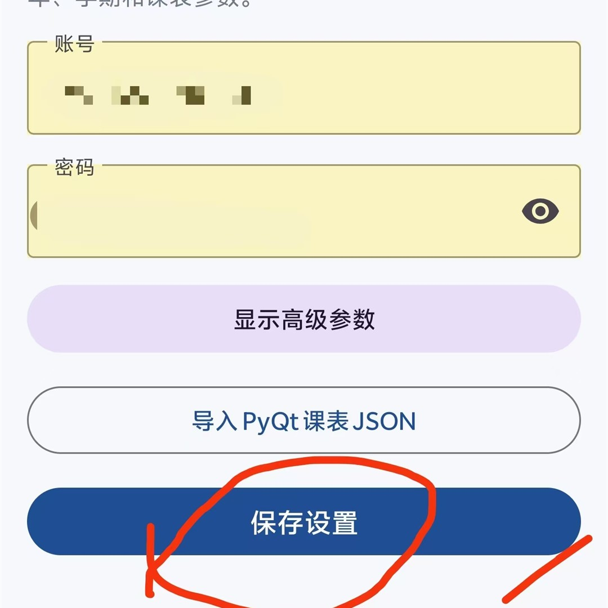

# 课表（Java 版）

无广告。

这是一个 Android 课表应用，默认适配南宁职业技术大学教务系统并内置其登录地址。输入教务账号和密码后，可以登录并更新课表；也支持导入 PyQt 课表 JSON 文件。

<p align="center">
  
  
</p>

## 发布内容

- `app/`：Java 源码和 Android 资源
- `releases/KeBiao-release.apk`：可安装的正式签名 APK
- `gradlew.bat` 与 `gradle/wrapper/`：Gradle Wrapper

本仓库不包含任何真实账号、密码、Cookie、课程数据、模拟器数据、本机 SDK 路径或签名密钥。

## 构建

1. 用 Android Studio 打开本目录，按提示设置本机 Android SDK；IDE 会创建未纳入 Git 的 `local.properties`。
2. 使用 JDK 17 或 Android Studio 自带 JDK 执行：

```powershell
.\gradlew.bat :app:assembleDebug :app:testDebugUnitTest
```

生成的调试 APK 位于 `app/build/outputs/apk/debug/app-debug.apk`。

如需生成正式签名 APK，在项目根目录创建被 Git 忽略的 `key.properties`，再执行 `./gradlew.bat :app:assembleRelease`：

```properties
storeFile=C:/path/to/your-release-key.jks
storePassword=你的密钥库密码
keyAlias=你的密钥别名
keyPassword=你的密钥密码
```

生成文件位于 `app/build/outputs/apk/release/app-release.apk`。

## 安装

将 `releases/KeBiao-release.apk` 复制到 Android 8.0（API 26）或更高版本的设备并安装。

APK 的 SHA-256 校验值记录在 `releases/KeBiao-release.apk.sha256`。

## 使用说明

首次使用时，打开“设置”页填写账号和密码并保存；返回“课表”页，点击右上角蓝色加号即可导入或更新课表。

## 数据与网络

账号和密码仅由用户在自己的设备上填写；仅在用户主动更新课表时发送到其配置的教务系统，不会发送到开发者服务器。应用数据备份已关闭，避免系统云备份导出设置数据。默认教务系统地址使用 HTTP，因为目标教务系统当前提供该地址；在不受信任的网络环境中请谨慎登录。

## 发布前检查

仓库已配置 `.gitignore`，会忽略本机配置、签名文件、构建目录、备份和设备调试资料。提交前仍建议执行：

```powershell
git status --ignored
```
